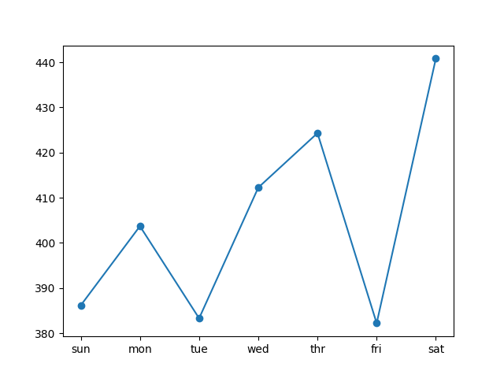

#  Long Short-Term Memory Model to forecast power usage

This problem is framed as such:
"Given recent power consumption, what is the expected power consumption for the week ahead?"

## The dataset
The dataset can be found at the [UCI Machine Learning repository](https://archive.ics.uci.edu/ml/datasets/individual+household+electric+power+consumption).

The dataset is about 130mb, hence its been gitgnored. You can download it from the link provided.

**Source**: Georges Hebrail (georges.hebrail '@' edf.fr), Senior Researcher, EDF R&D, Clamart, France

The dataset contains the following Attribute Information:

1.date: Date in format dd/mm/yyyy
2.time: time in format hh:mm:ss
3.global_active_power: household global minute-averaged active power (in kilowatt)
4.global_reactive_power: household global minute-averaged reactive power (in kilowatt)
5.voltage: minute-averaged voltage (in volt)
6.global_intensity: household global minute-averaged current intensity (in ampere)
7.sub_metering_1: energy sub-metering No. 1 (in watt-hour of active energy). It corresponds to the kitchen, containing mainly a dishwasher, an oven and a microwave (hot plates are not electric but gas powered).
8.sub_metering_2: energy sub-metering No. 2 (in watt-hour of active energy). It corresponds to the laundry room, containing a washing-machine, a tumble-drier, a refrigerator and a light.
9.sub_metering_3: energy sub-metering No. 3 (in watt-hour of active energy). It corresponds to an electric water-heater and an air-conditioner.

## Multivariate Encoder-Decoder LSTM
This template contains a take on the [Encoder-Decoder Architecture](https://d2l.ai/chapter_recurrent-modern/encoder-decoder.html) being used with the LSTM layers.

## Data preparation:
The function **series_series_to_supervised** was used to prepare the dataset in a way that makes sense for an LSTM.

Depending if the problem involves a univariate or Multivariate input, the function has to be changed as such, to output the correct x_output:
- Univariate
```
def series_to_supervised(train, n_input, n_out=7):
    #flattening data
    data = train.reshape((train.shape[0]*train.shape[1], train.shape[2]))
    X, y = list(), list()
    in_start = 0
    # stepping over the history, one step at a time
    for _ in range(len(data)):
        # defining the end of the input sequence
        in_end = in_start + n_input
        out_end = in_end + n_out
        # ensuring we have enough data for this
        if out_end <= len(data):
            x_input = data[in_start:in_end, 0]
            x_input = x_input.reshape((len(x_input), 1))
            X.append(x_input)
            y.append(data[in_end:out_end, 0])
        # moving along one step at a time
        in_start += 1
    return np.array(X), np.array(y)
```
- Multivariate
```
def series_to_supervised(train, n_input, n_out=7):
    #flattening data
    data = train.reshape((train.shape[0]*train.shape[1], train.shape[2]))
    X, y = list(), list()
    in_start = 0
    # stepping over the history, one step at a time
    for _ in range(len(data)):
        # defining the end of the input sequence
        in_end = in_start + n_input
        out_end = in_end + n_out
        # ensuring we have enough data for this
        if out_end <= len(data):
            # Multivariate appending:
            X.append(data[in_start:in_end, :])
            y.append(data[in_end:out_end, 0])
        # moving along one step at a time
        in_start += 1
    return np.array(X), np.array(y)
```

Moreover, the **forecast** function also has to be tweaked:
- Univariate
```
def forecast(model, history, n_input):
    # flatenning the data
    data = np.array(history)
    data = data.reshape((data.shape[0]*data.shape[1], data.shape[2]))
    # getting last observation for input
    input_x = data[-n_input:,0]
    # reshaping into [1, n_input, 1]
    input_x = input_x.reshape((1, len(input_x), 1))
    # running the forecaster
    yhat = model.predict(input_x, verbose=0)
    # getting the vector forecast
    yhat_vector = yhat[0]
    return yhat_vector
```
- Multivariate
```
def forecast(model, history, n_input):
	# flattening the array
	data = array(history)
	data = data.reshape((data.shape[0]*data.shape[1], data.shape[2]))
	# retrieving last observations for input
	input_x = data[-n_input:, :]
	# reshaping into [1, n_input, n]
	input_x = input_x.reshape((1, input_x.shape[0], input_x.shape[1]))
	# forecasting the next week
	yhat = model.predict(input_x, verbose=0)
	# Getting the forecast vector
	yhat = yhat[0]
	return yhat
```

## Testing, training, and fitting

The dataset was split into train/test sets.
The final year (2010ish) was used for evaluating the model (test)
And, three years' worth of data leading to the final year (2016-2019ish) were used for training the model (train).

## Walk-forward validation

A walk-forward validation method was used, in which real observations were appended to the ongoing model history to be used to predict the following week.

The X and y arrays were reshaped to have the following input (crucial for LSTM):
[samples, time-steps, features]

It looks like this:
```
# Reshaping the inputs to be 3d [samples, timesteps, features]
train_X = train_X.reshape((train_X.shape[0],n_hours,n_features))
test_X = test_X.reshape((test_X.shape[0], n_hours, n_features)) 
```

At last, the fit() in-built function is used to fit the model, with defined epochs and batch-sizes.
the validation data used is the test_X and test_y arrays.

The following plot showcases the RMSE of each day of the forecast week:



## Libraries Used

| Name | Library |
| ------ | ------ |
| Pandas | https://pandas.pydata.org/ |
| Matplotlib | https://matplotlib.org/ |
| SciKitLearn | https://scikit-learn.org/stable/ |